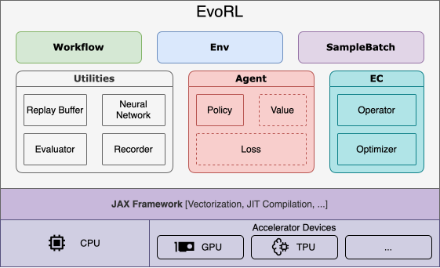
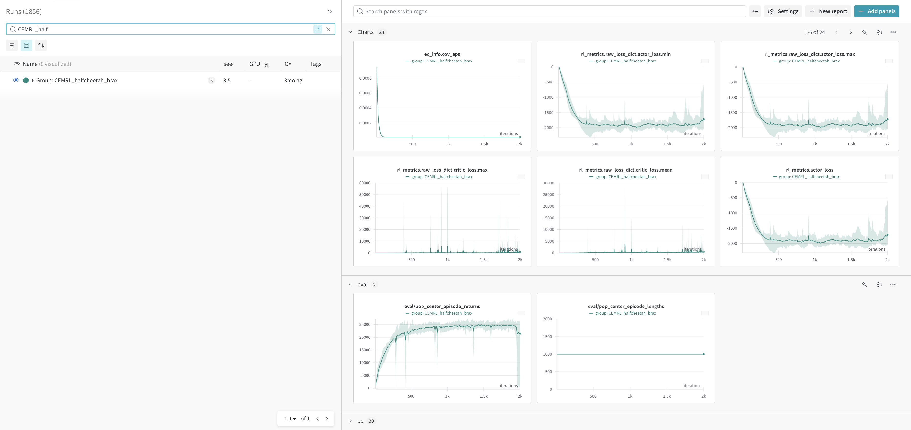
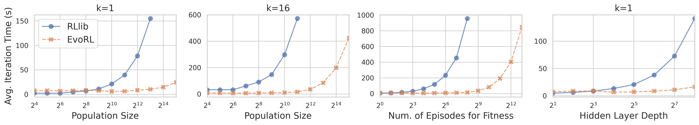
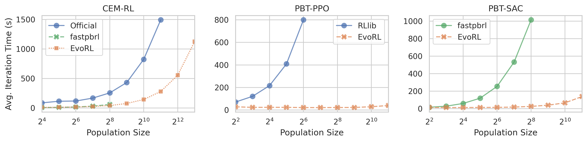

<h1 align="center">
  <a href="https://github.com/EMI-Group/evox">
    <picture>
      <source media="(prefers-color-scheme: dark)" srcset="docs/_static/evox_logo_dark.png">
      <source media="(prefers-color-scheme: light)" srcset="docs/_static/evox_logo_light.png">
      
    </picture>
  </a>
</h1>

<p align="center">
  
  
  
</p>

<h2 align="center">
  <p>🌟 EvoRL: A GPU-acclerated Framework for Evolutionary Reinforcement Learning 🌟</p>
  <a href="https://arxiv.org/abs/2501.15129">
    
  </a>
</h2>


# Table of Contents
- [Table of Contents](#table-of-contents)
- [Introduction](#introduction)
  - [Highlight](#highlight)
    - [Update](#update)
  - [Documentation](#documentation)
  - [Overview of Key Concepts in EvoRL](#overview-of-key-concepts-in-evorl)
- [Installation](#installation)
- [Quickstart](#quickstart)
  - [Training](#training)
  - [Logging](#logging)
    - [Env Rendering](#env-rendering)
- [Algorithms](#algorithms)
- [RL Environments](#rl-environments)
  - [Supported Environments](#supported-environments)
- [Performance](#performance)
- [Issues and Discussions](#issues-and-discussions)
- [Acknowledgement](#acknowledgement)
  - [Citing EvoRL](#citing-evorl)


# Introduction

EvoRL is a fully GPU-acclerated framework for Evolutionary Reinforcement Learning, which is implemented by JAX and provides end-to-end GPU-acclerated training pipelines, including following processes:

- Reinforcement Learning (RL)
- Evolutionary Computation (EC)
- Environment Simulation

EvoRL provides a highly efficient and user-friendly platform to develop and evaluate RL, EC and EvoRL algorithms.

> [!NOTE]
> EvoRL is a sister project of [EvoX](https://github.com/EMI-Group/evox).

## Highlight

- **End-to-end training pipelines**: The training pipelines for RL, EC and EvoRL are entirely executed on GPUs, eliminating dense communication between CPUs and GPUs in traditional implementations and fully utilizing the parallel computing capabilities of modern GPU architectures.
  - Most algorithms has a `Workflow.step()` function that is capable of `jax.jit` and `jax.vmap()`, supporting parallel training and JIT on full computation graph.
  - The maximum seed-up is up to 60x depend on the algorithms, see [Performance](#performance).
- **Easy integration between EC and RL**: Due to modular design, EC components can be easily plug-and-play in workflows and cooperate with RL.
- **Implementation of EvoRL algorithms**: Currently, we provide two popular paradigms in Evolutionary Reinforcement Learning: Evolution-guided Reinforcement Learning (ERL): ERL, CEM-RL; and Population-based AutoRL: PBT.
- **Unified Environment API**: Support multiple GPU-accelerated RL environment packages (eg: Brax, gymnax, ...). Multiple Env Wrappers are also provided.
- **Object-oriented functional programming model**: Classes define the static execution logic and their running states are stored externally.

### Update

- 2025-04-01: Add support for Mujoco Playground Environments.

## Documentation

- For comprehensive guidance, please visit our [Documentation](https://evorl.readthedocs.io/latest/), where you'll find detailed installation steps, tutorials, practical examples, and complete API references.

- EvoRL is also indexed by DeepWiki, providing an AI assistant for beginners. Feel free to ask any question about this repo at https://deepwiki.com/EMI-Group/evorl.

## Overview of Key Concepts in EvoRL



- **Workflow** defines the training logic of algorithms.
- **Agent** defines the behavior of a learning agent, and its optional loss functions.
- **Env** provides a unified interface for different environments.
- **SampleBatch** is a data structure for continuous trajectories or shuffled transition batch.
- **EC** module provide EC components like Evolutionary Algorithms (EAs) and related operators.


# Installation

EvoRL is based on `jax`. So `jax` should be installed first, please follow [JAX official installation guide](https://jax.readthedocs.io/en/latest/quickstart.html#installation). Since EvoRL is currently under development, we recommend installing the package from source.

```shell
# Install the evorl package from source
git clone https://github.com/EMI-Group/evorl.git
cd evorl
pip install -e .
```

For developers, see [Contributing to EvoRL](https://evorl.readthedocs.io/latest/dev/contributing.html)

# Quickstart

## Training

EvoRL uses [hydra](https://hydra.cc/) to manage configs and run algorithms. Users can use `scripts/train.py` to run algorithms from CLI. Specify the `agent` and `env` field based on the related config file path (`*.yaml`) in `configs` folder.

```text
# hierarchy of folder `configs/`
configs
├── agent
│   ├── ppo.yaml
│   ├── ...
...
├── config.yaml
├── env
│   ├── brax
│   │   ├── ant.yaml
│   │   ├── ...
│   ├── envpool
│   └── gymnax
└── logging.yaml
```


For example: To train the PPO agent with config file in `configs/agent/ppo.yaml` on environment Ant with config file in `configs/env/brax/ant.yaml`, type the following command:

```shell
python scripts/train.py agent=ppo env=brax/ant
```

Then the PPO algorithm starts training. If multiple GPUs are detected, most algorithms will automatically be trained in distributed mode.

For more advanced usage, see our documentation: [Training](https://evorl.readthedocs.io/latest/guide/quickstart.html#advanced-usage).

## Logging

When not using [multi-run mode](https://hydra.cc/docs/tutorials/basic/running_your_app/multi-run/) (without `-m`), the outputs will be stored in `./outputs`. When using [multi-run mode](https://hydra.cc/docs/tutorials/basic/running_your_app/multi-run/) (`-m`), the outputs will be stored in `./multirun`. Specifically, when launching algorithms from the training scripts, the log file and checkpoint files will be stored in `./outputs|multirun/train|train_dist/<timestamp>/<exp-name>/`.

By default, the script will enable two recorders for logging: `LogRecorder` and `WandbRecorder`. `LogRecorder` will save logs (`*.log`) in the above path, and `WandbRecorder` will upload the data to [WandB](https://wandb.ai/site/), which provides beautiful visualizations.

Screenshot in WandB dashboard:



### Env Rendering

We provide some example visualization scripts for brax and playground environments: [visualize_mjx.ipynb](./scripts/visualize_mjx.ipynb).

# Algorithms

Currently, EvoRL supports 4 types of algorithms

| Type                    | Algorithms                                                                                                    |
| ----------------------- | ------------------------------------------------------------------------------------------------------------- |
| RL                      | A2C, PPO, IMPALA, DQN, DDPG, TD3, SAC                                                                         |
| EA                      | OpenES, VanillaES, ARS, CMA-ES, algorithms from [EvoX](https://github.com/EMI-Group/evox) (PSO, NSGA-II, ...) |
| Evolution-guided RL     | ERL-GA, ERL-ES, ERL-EDA, CEMRL, CEMRL-OpenES                                                                  |
| Population-based AutoRL | PBT family (e.g: PBT-PPO, PBT-SAC, PBT-CSO-PPO)                                                               |

# RL Environments

By default, `pip install evorl` will automatically install environments on `brax`. If you want to use other supported environments, please install the additional environment packages. We provide useful extras for different environments.

For example:

```shell
# ===== GPU-accelerated Environments =====
# Mujoco playground Envs:
pip install -e ".[mujoco-playground]"
# gymnax Envs:
pip install -e ".[gymnax]"
# Jumanji Envs:
pip install -e ".[jumanji]"
# JaxMARL Envs:
pip install -e ".[jaxmarl]"

# ===== CPU-based Environments =====
# EnvPool Envs: (also require py<3.12)
pip install -e ".[envpool]"
# Gymnasium Envs:
pip install -e ".[gymnasium]"
```

> [!WARNING]
> These additional environments have limited supports and some algorithms are incompatible with them.

## Supported Environments

| Environment Library                                                        | Descriptions                            |
| -------------------------------------------------------------------------- | --------------------------------------- |
| [Brax](https://github.com/google/brax)                                     | Robotic control                         |
| [MuJoCo Playground](https://github.com/google-deepmind/mujoco_playground)  | Robotic control                         |
| [gymnax (experimental)](https://github.com/RobertTLange/gymnax)            | classic control, bsuite, MinAtar        |
| [JaxMARL (experimental)](https://github.com/FLAIROx/JaxMARL)               | Multi-agent Envs                        |
| [Jumanji (experimental)](https://github.com/instadeepai/jumanji)           | Game, Combinatorial optimization        |
| [EnvPool (experimental)](https://github.com/sail-sg/envpool)               | High-performance CPU-based environments |
| [Gymnasium (experimental)](https://github.com/Farama-Foundation/Gymnasium) | Standard CPU-based environments         |

# Performance

Test settings:

- Hardware:
  - 2x Intel Xeon Gold 6132 (56 logical cores in total)
  - 128 GiB RAM
  - 1x Nvidia RTX 3090
- Task: Swimmer




# Issues and Discussions

To keep our project organized, please use the appropriate section for your topics:

- Issues – For reporting **bugs** and **PR** only. When submitting an issue, please provide clear details to help with troubleshooting.
- Discussions – For general questions, feature requests, and other topics.

Before posting, kindly check existing issues and discussions to avoid duplicates. Thank you for your contributions!

# Acknowledgement

- [acme](https://github.com/google-deepmind/acme)
- [EvoX](https://github.com/EMI-Group/evox)
- [Brax](https://github.com/google/brax)
- [MuJoCo Playground](https://github.com/google-deepmind/mujoco_playground)
- [Jumanji](https://github.com/instadeepai/jumanji)
- [JaxMARL](https://github.com/FLAIROx/JaxMARL)
- [gymnax](https://github.com/RobertTLange/gymnax)
- [EnvPool](https://github.com/sail-sg/envpool)

## Citing EvoRL

If you use EvoRL in your research and want to cite it in your work, please use:

```
@article{zheng2025evorl,
  author    = {Bowen Zheng, Ran Cheng, Kay Chen Tan},
  journal   = {arXiv},
  pages     = {},
  publisher = {arXiv},
  title     = {{EvoRL}: A GPU-accelerated Framework for Evolutionary Reinforcement Learning},
  volume    = {abs/2501.15129},
  year      = {2025}
}
```
